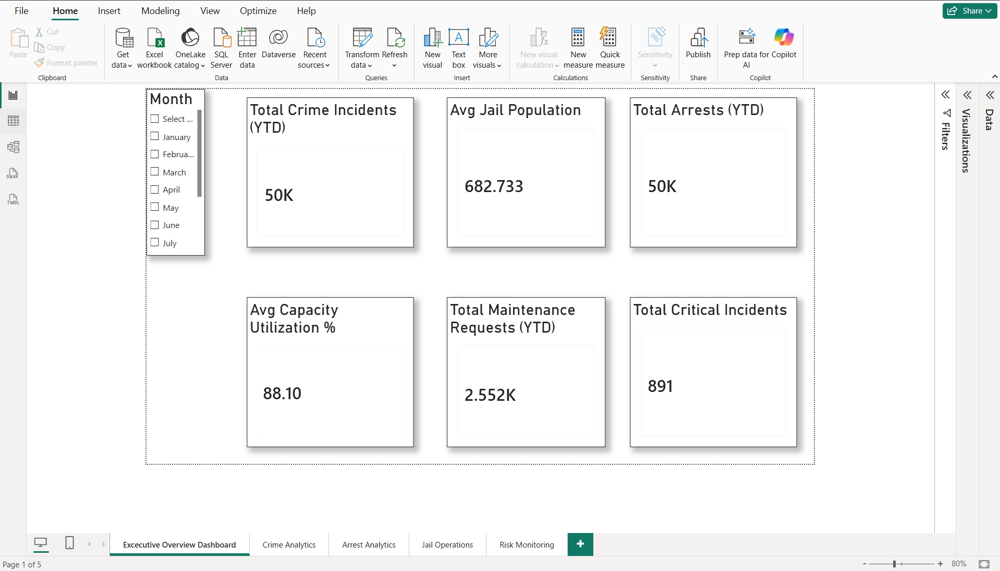
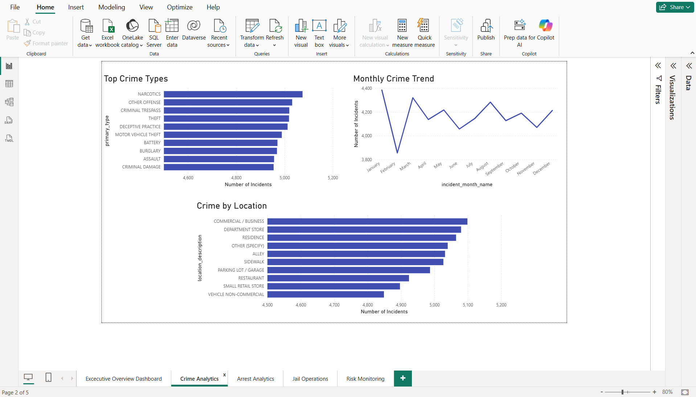
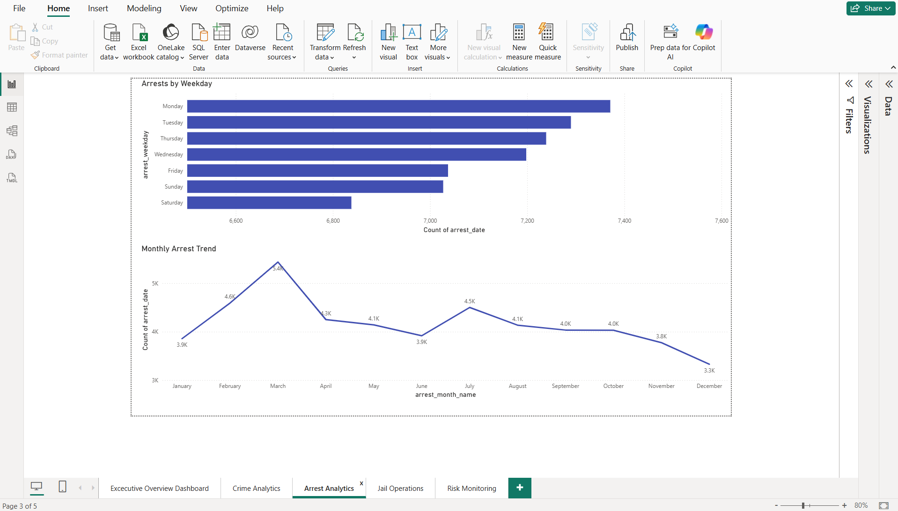
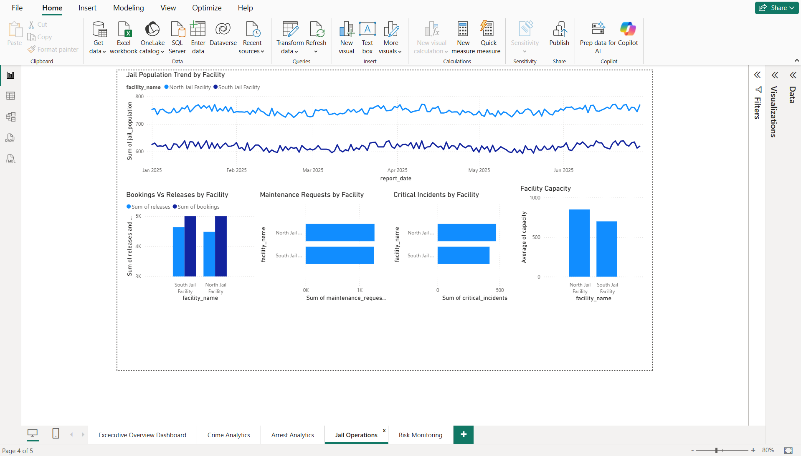
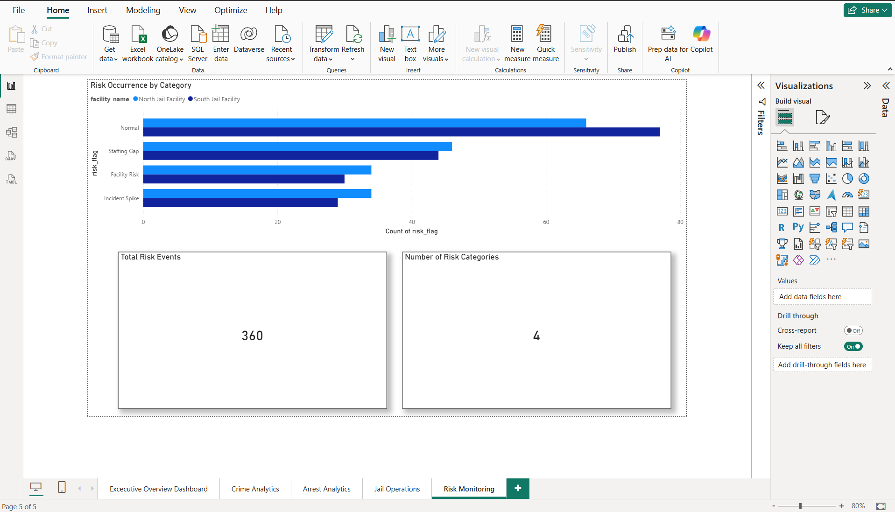

# Public Safety Analytics Dashboard

## Overview
This project is a multi-page operational data analytics dashboard built using SQL Server, Power BI, Python, and Google Colab.

It analyzes:
- crime incidents
- arrest activity
- jail operations
- facility capacity
- operational risk indicators

The project simulates a public safety reporting environment by combining public datasets with generated operational facility data.

---

## Tools Used
- SQL Server Express
- SQL Server Management Studio (SSMS)
- Power BI Desktop
- Python
- Google Colab
- Pandas
- GitHub

---

## Project Highlights
1. Built a multi-page Power BI operational analytics dashboard  
2. Designed SQL queries to generate analytical reporting datasets  
3. Simulated a public safety data environment including crime, arrests, and jail operations  
4. Developed KPIs for operational monitoring and resource planning  
5. Implemented a structured analytics pipeline using Python, SQL Server, and Power BI

---

## Dashboard Pages

### Executive Overview
High-level KPI dashboard for crime incidents, arrests, jail population, capacity utilization, maintenance requests, and critical incidents.

### Crime Analytics
Analysis of top crime types, crime by location, and monthly crime trends.

### Arrest Analytics
Analysis of arrests by weekday, hour of day, and monthly trend.

### Jail Operations
Facility-level monitoring of jail population trends, bookings vs releases, maintenance requests, critical incidents, and facility capacity.

### Risk Monitoring
Monitoring of risk occurrence by category and facility.

---

## Dashboard Preview

### Executive Overview

### Crime Analytics

### Arrest Analytics

### Jail Operations

### Risk Monitoring

---

## Data Pipeline
-This project uses a simplified analytics pipeline to simulate a real-world public safety data environment.

## Data Sources
-Sample datasets representing:
-Crime incidents
-Arrest records
-Jail operations
-Facility maintenance
-Operational risk indicators

## Data Warehouse
-Processed data was stored and structured using SQL Server.
-SQL was used to:
-Build analytical tables
-Aggregate operational metrics
-Generate reporting datasets
-Prepare data for dashboard consumption

## Folder Structure

public-safety-analytics-dashboard
│
├── data_sample
├── notebooks
├── sql
├── powerbi
├── screenshots
├── docs
└── README.md

---

## Included Files
- data_sample → sample datasets used in the project
- notebooks/public_safety_analytics_colab_notebook.ipynb → Colab notebook
- sql/public_safety_queries.sql → SQL queries used for analysis
- powerbi/Public_Safety_Analytics_Dashboard.pbix → Power BI dashboard
- screenshots → Dashboard screenshots

---

## Key Insights
-Crime incidents remained relatively stable across the year, averaging approximately 4,000–4,400 incidents per month, with January showing     the highest activity and February the lowest.
-The most frequent crime categories included Criminal Damage, Assault, Burglary, Battery, and Motor Vehicle Theft.
-Crime occurrences were concentrated in commercial/business areas, department stores, residences, alleys, and sidewalks, highlighting both public and residential exposure.
-Arrest activity peaked on Mondays, while Saturdays showed the lowest arrest counts, indicating weekday-heavy enforcement patterns.
-Arrests peaked during March, followed by gradual declines toward December.
-North Jail Facility consistently maintained a higher inmate population and experienced higher maintenance and critical incident counts compared to South Jail.
-Average jail capacity utilization was approximately 88%, indicating high but manageable facility occupancy.
-Among operational risk indicators, Staffing Gaps appeared most frequently, followed by Facility Risk and Incident Spikes, suggesting staffing coverage as a key operational concern.

---

## Potential Extensions
-Future enhancements could include:
-Integration with real public safety open data portals
-Predictive crime modeling
-Time series forecasting
-Resource allocation optimization
-Geographic crime heatmaps
